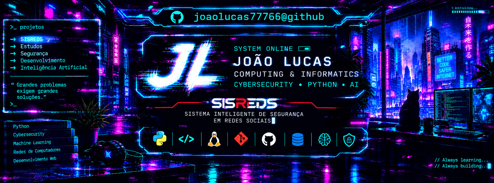
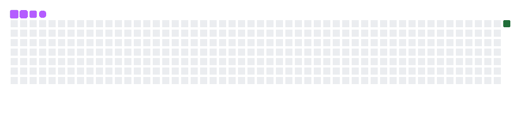
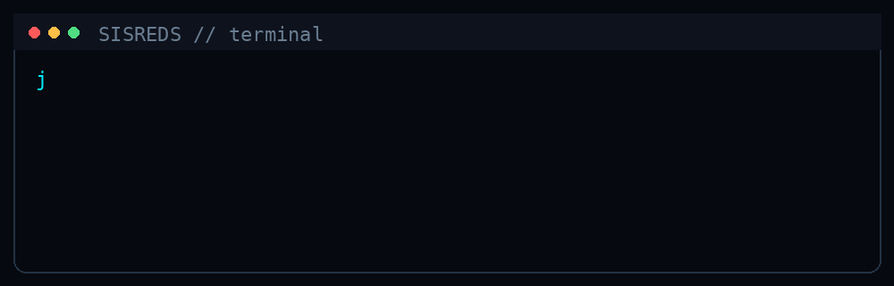

  

  

#  Olá, eu sou João Lucas!

🎓 Estudante de **Computação e Informática**  
💻 Desenvolvimento de Software  
🔐 Cibersegurança  
🤖 Inteligência Artificial  

---

## 🚀 Sobre mim

Sou estudante de Computação e Informática, interessado em desenvolvimento de software, segurança da informação e Inteligência Artificial.

Atualmente estou desenvolvendo o **SISREDS — Sistema Inteligente de Segurança em Redes Sociais**, um projeto acadêmico voltado à identificação e prevenção de ameaças presentes em ambientes digitais. O SISREDS combina desenvolvimento web, processamento de dados, Inteligência Artificial e técnicas de segurança da informação.

Busco transformar conhecimento acadêmico em projetos práticos, explorando novas tecnologias e aprimorando continuamente minhas habilidades em programação.

---

  

---
## 🛠️ Tecnologias & Ferramentas

### 💻 Desenvolvimento

### 🔐 Segurança & Sistemas

### 🤖 Dados & Inteligência Artificial

---

## 📚 Atualmente estudando

- 🐍 Python e desenvolvimento de aplicações
- 🌐 Desenvolvimento Web
- 🔐 Segurança da Informação
- 🤖 Inteligência Artificial
- 📊 Processamento e análise de dados
- 🧩 Desenvolvimento de extensões para navegadores
- 🐙 Git e GitHub

---

## 📈 GitHub

Aqui compartilho meus estudos, projetos acadêmicos e experimentos em programação.

---

## 🎯 Objetivo

Continuar evoluindo como desenvolvedor, aprofundando meus conhecimentos em **programação, cibersegurança e Inteligência Artificial**, enquanto desenvolvo projetos que possam resolver problemas reais.

---

### 💻 Sempre aprendendo. Sempre construindo. 🚀

